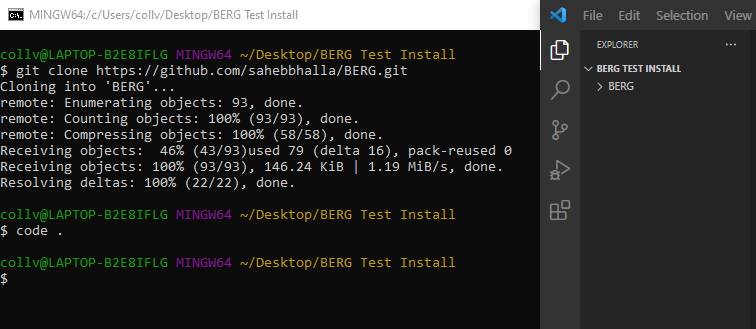

#   BERG

## Description

The BERG web page uses the users location to determine the current weather in the area. Another target destination can be added by the user for which directions will be created.

- The motivation behind this app was to help users get to where they are travelling while also being aware of the current weather conditions
- BERG helps save time and money by users not getting lost

## Table of Contents (Optional)

If your README is long, add a table of contents to make it easy for users to find what they need.

- [Installation](#installation)
- [Credits](#credits)
- [License](#license)

## Installation

To install the project:

1. Open a gitBash wnidow in the directory you would like to add the repository
2. Copy and paste the following code into the terminal window: 'git clone https://github.com/sahebbhalla/BERG.git'
3. Finally, to enter the development environment type: 'Code .' into the terminal

## Credits

Collaborators:
- Saheb Bhalla [Git Hub](https://github.com/sahebbhalla)
- Erifeoluwa Femi-ladiran [Git Hub](https://github.com/FOR-TIMI)
- Mahesh Ramdas [Git Hub](https://github.com/maheshramdas)
- Justin Collver [Git Hub](https://github.com/threewide)

API's:
- Google [Google Maps](https://developers.google.com/maps/documentation)
- Map Box [Map Box](https://docs.mapbox.com/api/)
- Open Weather [Open Weather Map](https://openweathermap.org/api/one-call-api)

CSS Framework's:
- Tailwind CSS [Tailwind CSS](https://tailwindcss.com/docs/installation)

Guide's:
- Rich Widtmann [Professional README Guide](https://coding-boot-camp.github.io/full-stack/github/professional-readme-guide)

## License

Copyright (c) [2022] [Justin Collver]

Permission is hereby granted, free of charge, to any person obtaining a copy
of this software and associated documentation files (the "Software"), to deal
in the Software without restriction, including without limitation the rights
to use, copy, modify, merge, publish, distribute, sublicense, and/or sell
copies of the Software, and to permit persons to whom the Software is
furnished to do so, subject to the following conditions:

The above copyright notice and this permission notice shall be included in all
copies or substantial portions of the Software.

THE SOFTWARE IS PROVIDED "AS IS", WITHOUT WARRANTY OF ANY KIND, EXPRESS OR
IMPLIED, INCLUDING BUT NOT LIMITED TO THE WARRANTIES OF MERCHANTABILITY,
FITNESS FOR A PARTICULAR PURPOSE AND NONINFRINGEMENT. IN NO EVENT SHALL THE
AUTHORS OR COPYRIGHT HOLDERS BE LIABLE FOR ANY CLAIM, DAMAGES OR OTHER
LIABILITY, WHETHER IN AN ACTION OF CONTRACT, TORT OR OTHERWISE, ARISING FROM,
OUT OF OR IN CONNECTION WITH THE SOFTWARE OR THE USE OR OTHER DEALINGS IN THE
SOFTWARE.

---